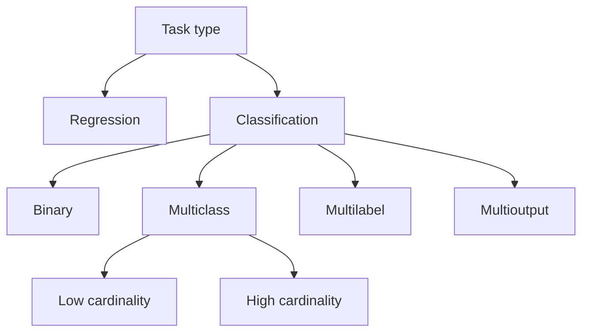

Every method that predicts a discrete class, label, or category for an input: spam or not, cat or dog or car. A [[Supervised Learning]] task, separated from [[Regression]] by its target being drawn from a finite unordered set rather than from a continuum. That separation is a statement about how the problem was framed and not about the data, because either task converts into the other. Quantizing a continuous target into buckets makes it a classification target: house prices become low, medium and high, and the regressor becomes a classifier. Going the other way, predicting a score in $[0, 1]$ and cutting it at a chosen threshold makes a continuous output into a class: an email gets a spam score, and everything above the cut is spam. The second direction is less a conversion than a description of how classifiers already work, since [[Binary Classification]] states that nearly every binary classifier is a real-valued scoring function plus a cut point. Four varieties sit under it, told apart by how many labels one instance may carry and how many values each label may take: [[Binary Classification]], one label with two values; [[Multiclass Classification]], one label with three or more mutually exclusive values; [[Multilabel Classification]], several binary labels at once; [[Multioutput Classification]], several labels each with three or more values. Whichever variety is in play, a classifier is judged in one of two ways. Measures taken on predicted labels are read off a [[Confusion Matrix]] of predictions against truth, and each is a ratio of its cells rather than an independent measurement. Measures taken on predicted probabilities are not: [[Log Loss]] reads the probability itself and no confusion matrix can produce it.



## Methods

- [[Logistic Regression]]: linear score through a sigmoid, thresholded. The baseline.
- [[Softmax Regression]]: one linear score per class, turned into a distribution over the classes and fitted as a single model over all $K$ of them at once. The alternative to wrapping a binary classifier in [[One-versus-Rest]] or [[One-versus-One]], since the classes compete inside one optimization rather than being fitted apart and compared afterwards.
- [[Stochastic Gradient Descent Classifier]]: a linear classifier fitted one instance at a time, its `loss` deciding which linear model is actually being fitted. The choice when the training set is too large to pass over whole, or arrives as a stream.

Meta-estimators, which classify nothing themselves and instead extend a binary classifier to the other three varieties:

- [[One-versus-Rest]]: one binary classifier per class, each trained on the whole set, highest score wins. The cheaper decomposition in classifier count and the usual default.
- [[One-versus-One]]: one binary classifier per pair of classes, each trained only on those two classes, most votes wins. Worth its extra classifiers when the base algorithm's fit cost grows faster than linearly in the number of instances.
- [[Classifier Chain]]: one binary classifier per label, each fed the labels predicted before it, so the labels are not assumed independent of one another.
- [[Hierarchical Classification]]: a tree over the classes with one classifier at each internal node, deciding only among that node's children, so a prediction is a path from the root to a leaf. The decomposition for a high cardinality label space, and only where the problem domain already supplies the tree.

Not yet written, with the chapter that brings each:

- Support vector machines, chapter 5.
- Decision trees, chapter 6.
- Random forests, voting, bagging and boosting, chapter 7.
- k-nearest neighbours, which chapter 3 uses for its multilabel and multioutput examples but which no HOML chapter takes as its subject.

```base
filters:
  and:
    - file.hasLink(this.file)
    - file.inFolder("Knowledge")
views:
  - type: table
    name: Linked here
    order:
      - file.name
      - note_kind
      - confidence
    sort:
      - property: file.name
        direction: ASC
      - property: confidence
        direction: DESC

```
