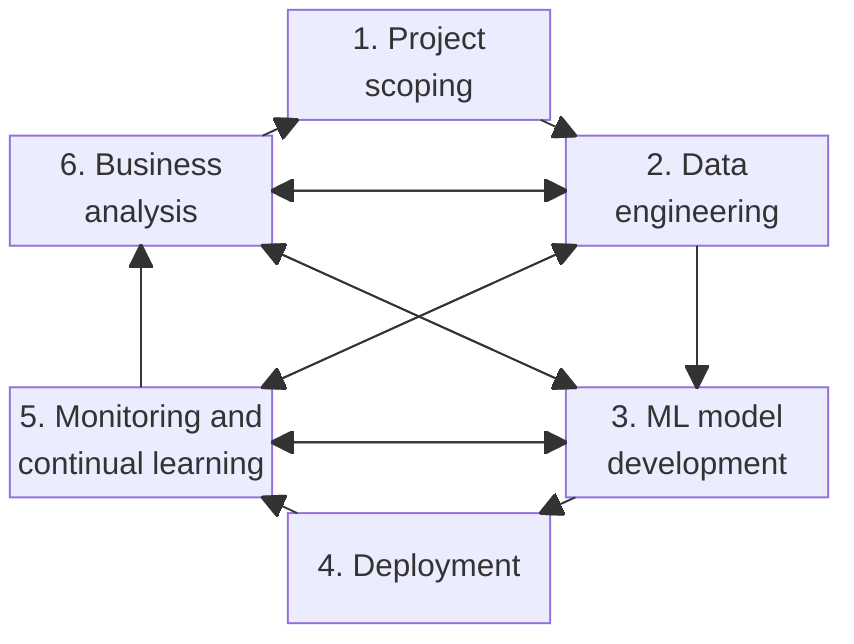

## Definition

Developing a machine learning model is an iterative process and, in most cases, a never-ending one. Concretely, the work has six named phases and the sixth returns to the first, so the process has no terminal state: a project is not finished, it is between iterations.

### The six phases

1. **Project scoping.** Goals, objectives and constraints are set, stakeholders are identified, and resources are estimated and allocated.
2. **Data engineering.** Raw data arriving from different sources and in different formats is handled, and a training set is curated out of it by sampling and by generating labels. The phase borrows its name from [[Data Engineering]], which is a note in the neighbouring data domain about who does that work and what infrastructure they own, a standing role held whether or not a model is ever fitted on anything it moves, while what is named here is one phase of one project.
3. **Machine learning model development.** Features are extracted and initial models are developed on the engineered features. The extraction is [[Feature Engineering]], which is the map applied to every instance rather than the phase the map gets written in.
4. **Deployment.** The model is made accessible to its users.
5. **Monitoring and continual learning.** The model is monitored for performance decay, and maintained so that it stays adaptive to changing environments and changing requirements. The decay is [[Model Rot]] under another of its names, and the maintenance is [[Continual Learning]].
6. **Business analysis.** Model performance is evaluated against business goals and analysed to generate business insight.

## Formal statement

Read the six phases as the nodes of a directed graph, numbered as above. A picture cannot be checked against a claim and a stated adjacency can, so the adjacency is what follows.

Six forward edges form a single cycle:

$$1 \rightarrow 2 \rightarrow 3 \rightarrow 4 \rightarrow 5 \rightarrow 6 \rightarrow 1$$

Four further connections run in both directions, and they are not arbitrary. Every one of them joins one of the two late phases, 5 monitoring and continual learning and 6 business analysis, to one of the two build phases, 2 data engineering and 3 model development. The four are 6 with 2, 6 with 3, 5 with 2, and 5 with 3, which is every pair in the product of those two sets:

$$\{5, 6\} \times \{2, 3\}$$

So the feedback in this process is not a general licence for any phase to send you back to any other. It is exactly the complete bipartite connection between the phases that learn something from a running system and the phases that build one, eight directed edges on top of the six forward ones, fourteen in all, and no back edge touches 4 deployment or 1 project scoping.

That is the falsifiable claim, and what it implies is worth stating separately. The phases that generate evidence are the late ones, and the phases that can act on evidence are the build ones. Deployment is therefore a pass-through, carrying the model from development to the place evidence starts arriving without ever being a destination, and project scoping is reached only by completing a full cycle, which is to say only through business analysis.

The never-ending claim is a property of the same graph. The cycle above passes through every node, so no node is terminal: from wherever a project currently is, there is a path onward, and there is no vertex with no outgoing edge. A project's state is therefore a position in the cycle rather than a percentage of completion, and the number of iterations run is not bounded by anything in the structure.

### The hierarchy of needs

Nothing at the learning level of an organization is reachable until the layers under it are in place, and there are four of them: collecting, moving and storing, exploring and transforming, and aggregating and labelling. That is the same ordering step 2 of the loop asserts, a training set curated out of raw data before step 3 has anything to fit. Three of those four layers are the subject of the neighbouring data domain rather than this one. [[Data Engineering]] is the role that owns the moving and the storing, [[Extract-Transform-Load]] is the machinery the moving and the transforming are usually made of, and [[Data Systems]] is the domain both of those sit in.

The ordering is Monica Rogati's, from "The AI Hierarchy of Needs", published on Hacker Noon in June 2017 as a blog post rather than as a reviewed paper. That is worth saying plainly, because a pyramid published that way is weak evidence for anything structural, and only the precedence claim above is taken from it.

## Where it is used

[[Machine Learning Systems Design]] is the activity whose object this is: the loop is the shape of the work, and the design is what fixes the requirements each turn of it has to satisfy. [[Machine Learning Applicability]] is the gate in front of step 1, checked before goals, stakeholders and resources are worth fixing at all. [[MLOps]] is the practice covering steps 4 and 5 and only those, a boundary drawn deliberately, which is why the loop crossing back into steps 2 and 3 is not that practice widening.

[[Model Rot]] is what step 5 monitors for, and [[Continual Learning]] is what step 5 does about it. [[Data Engineering]] is the role that owns the infrastructure step 2 runs on, in a domain whose subject stands whether or not a model is ever fitted. [[Business Objective]] is what step 1 fixes and what step 6 measures against, which is what makes the last edge back to the first phase a comparison rather than a restart. [[Production Machine Learning]] is the setting steps 4 through 6 take place in, and the reason there is a step 6 at all: a model that serves live traffic is judged by what it does to the business rather than by the score it was selected on.
